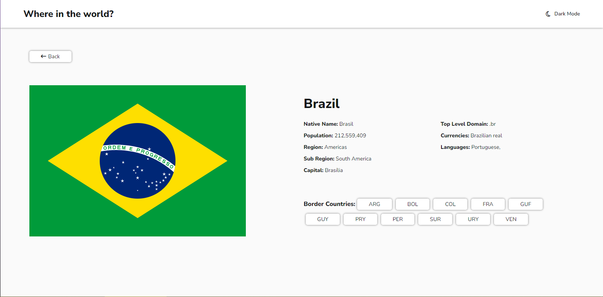

# Rest Countries Api With Color Theme Switcher



## Descrição

Este é o meu projeto para o Desafio Frontend Mentor, que consiste em criar um catálogo de países que consome uma API para listar todos os países do mundo e exibir seus dados. O projeto foi desenvolvido utilizando React, TailwindCSS, Framer Motion, Radix UI, React Router, React Query e Axios.

[Link do Desafio](https://www.frontendmentor.io/challenges/rest-countries-api-with-color-theme-switcher-5cacc469fec04111f7b848ca)

## Funcionalidades

- Lista todos os países do mundo.
- Mostra detalhes de cada país, incluindo informações como nome, bandeira, população, capital, etc.
- Navegação entre a página de detalhes de cada país utilizando React Router.
- Utiliza React Query para otimizar as requisições à API.
- Interface de usuário responsiva e estilizada com TailwindCSS.
- Animações utilizando Framer Motion.
- Oferece um switcher de tema que permite alternar entre os temas dark e light.

## Como Executar

1. Clone este repositório em sua máquina local.
2. Instale as dependências usando o comando:
   ```
   npm install
   ```
3. Inicie o aplicativo com:
   ```
   npm run dev
   ```
4. Abra o aplicativo no seu navegador.

## Contribuições

Contribuições são bem-vindas! Sinta-se à vontade para abrir problemas ou enviar pull requests.